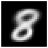

# Variational Autoencoders (VAEs) on MNIST Dataset

This repository contains implementations and experiments with various types of Variational Autoencoders (VAEs) applied to the MNIST dataset. VAEs are generative models that learn to encode and decode data in a probabilistic manner, making them particularly useful for image generation tasks.

## Table of Contents

- [Introduction](#introduction)
- [Implemented Models](#implemented-models)
- [Dependencies](#dependencies)

## Introduction

Variational Autoencoders are a class of generative models that learn to represent data in a latent space. This repository explores different types of VAEs, including Convolutional VAEs, Dense VAEs, and Conditional VAEs, applied to the MNIST dataset. Each model is implemented and tested for its ability to generate realistic digit images.

## Implemented Models

1. **Vanilla VAE**: A basic VAE architecture using fully connected layers.
2. **Convolutional VAE**: Utilizing convolutional layers for image-related tasks.
3. **Conditional VAE**: A VAE that conditions the generation on a specific digit class.

## Dependencies

Ensure you have the following dependencies installed:

- Python 3.x
- TensorFlow
- NumPy
- Matplotlib
- Jupyter (for running notebooks)

## The latent space clusters of different digit classes:

{:width="200"}

{:width="200"}

{:width="200"}

## Grid of sampled digit images generated by different latent variables:

{:width="200"}

{:width="200"}

{:width="200"}

## The generated sample with VAEs:

_vanilla.png){:width="200"}

%20for%20Convolutional%20VAE.png){:width="200"}

{:width="200"}

